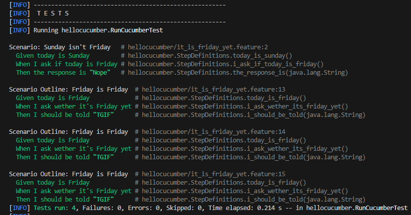
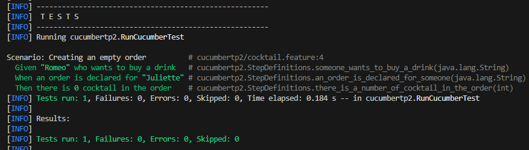

= R5.A.08 -- Dépôt pour les TPs
:icons: font
:MoSCoW: https://fr.wikipedia.org/wiki/M%C3%A9thode_MoSCoW[MoSCoW]

Ce dépôt concerne les rendus de mailto:ludovic.estival@etu.univ-tlse2.fr[Ludovic Estival].

== TP1

Fichier `is_it_friday_yet.feature`:
[source]
----
Feature: It is Friday yet ?
    Scenario: Sunday isn't Friday
        Given today is Sunday
        When I ask if today is Friday
        Then the response is "Nope"

    Scenario Outline: Friday is Friday
        Given today is Friday
        When I ask wether it's Friday yet
        Then I should be told "TGIF"
        Examples:
        | day            | answer |
        | Friday         | TGIF   |
        | Sunday         | Nope   |
        | anything else! | Nope   |
----

Lancement des tests:

== TP2

Fichier `Order.java`:
[source,java]
----
package cucumbertp2;

import java.util.List;
import java.util.ArrayList;

public class Order {

    private String owner;
    private String target;
    private List<String> cocktailsList = new ArrayList<String>();

    public void declareOwner(String someone) {
        this.owner = someone;
    }

    public void declareTarget(String someone) {
        this.target = someone;
    }

    public void getCocktails() {
        return this.cocktailsList;
    }
}
----

Lancement des tests:
